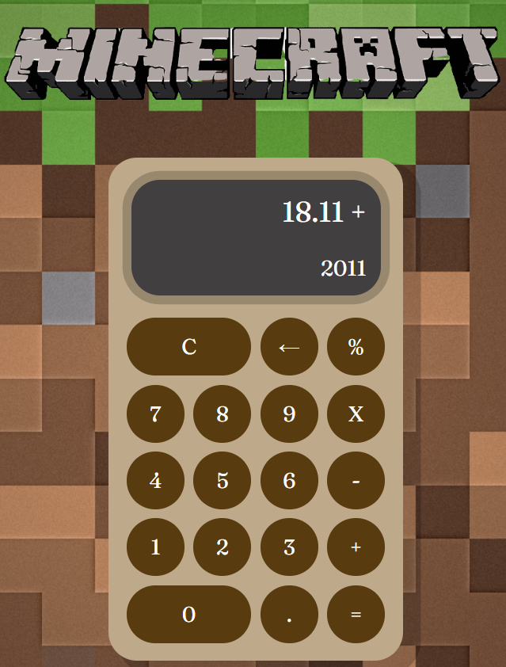

# Calculadora JS

 
------

### `Sobre:`

Realizada com intuito de colocar em prática aprendizados em Javascript, além de fixar HTML e CSS utilizando o tema 'Minecraft' para a calculadora.

----
### `Operações disponíveis:`

**Adição / Subtração / Multiplicação / Divisão**

----
### `Valor da calculadora:`

------------

### `Link:` **calculadora-minecraft.netlify.app**

